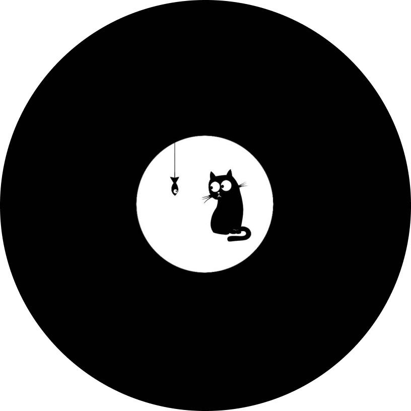

<div align="center">
  
  <h1>Git Glimpse</h1>
  <p>Your GitHub Profile in an Elegant App</p>
</div>

<div align="center">
  <a href="#overview">Overview</a> •
  <a href="#features">Features</a> •
  <a href="#demo">Demo</a> •
  <a href="#getting-started">Getting Started</a> •
  <a href="#contributing">Contributing</a> •
  <a href="#license">License</a> •
  <a href="#contact">Contact</a>
</div>


---
## Overview

Git Glimpse is a Flutter-based mobile application that provides you with a comprehensive and convenient way to view your GitHub profile right from your mobile device. With Git Glimpse, you can easily stay updated on your repositories, followers, following, and much more, all in a sleek and user-friendly interface.

## Features

- **GitHub Profile Overview:** Quickly view your GitHub profile, including your avatar, username, bio, and follower/following counts.

- **Interactive Repositories:** Explore your repositories with ease, complete with repository names, descriptions, and star/fork counts.

- **GitHub Activity Tracker:** Keep track of your GitHub contributions, such as commits, pull requests, and issues, all in one place.

## Demo


## Getting Started

To get started with Git Glimpse, follow these simple steps:

1. **Clone the Repository:**

   ```shell
   git clone https://github.com/Sayeed-Maheen/Git-Glimpse.git

2. **Install Dependencies:**

   ```shell
   cd Git-Glimpse
   flutter pub get

3. **Run the App:**

   ```shell
   flutter run

## Contributing

Pull requests are welcome. For major changes, please open an issue first
to discuss what you would like to change.

Please make sure to update tests as appropriate.

## License

Git Glimpse is licensed under the MIT License. See the [LICENSE](https://choosealicense.com/licenses/mit/) file for details.

## Contact

If you have questions, suggestions, or issues, please don't hesitate to [contact me](mailto:sayeedhassan1124@gmail.com).

